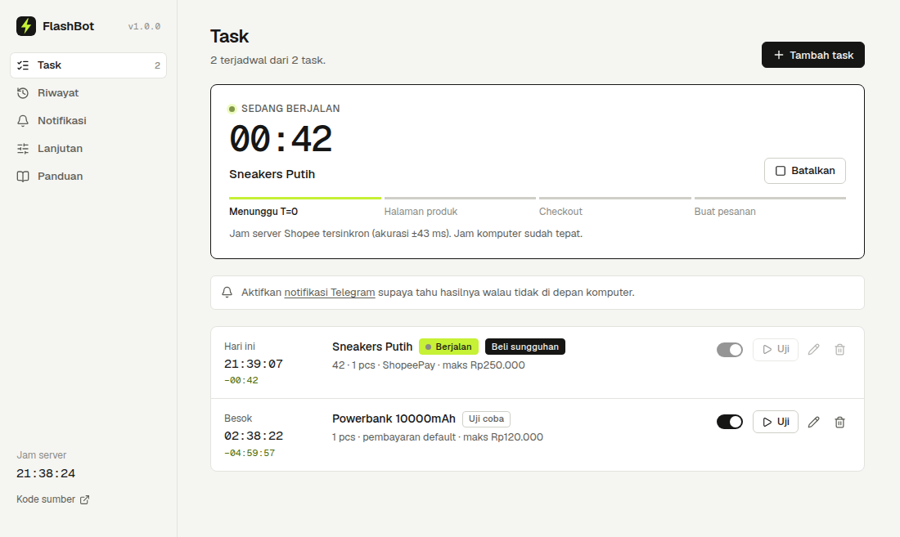
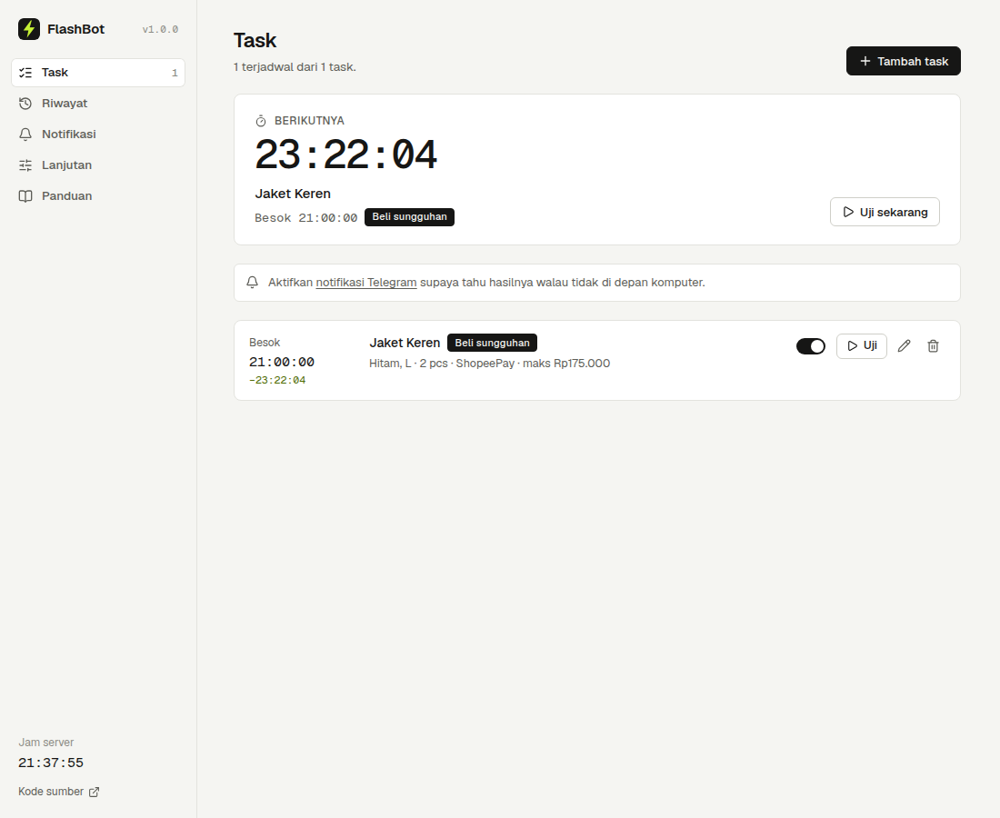
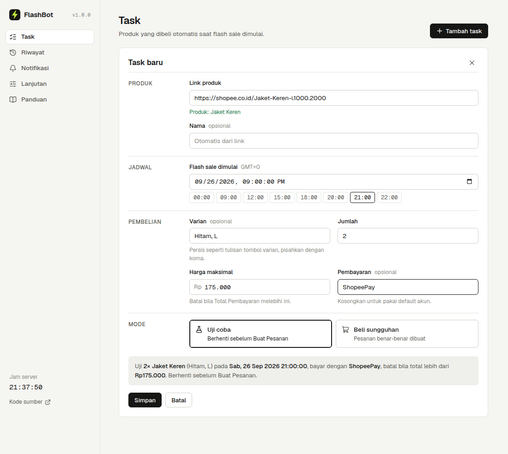
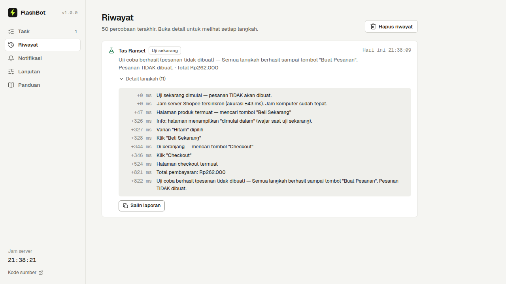
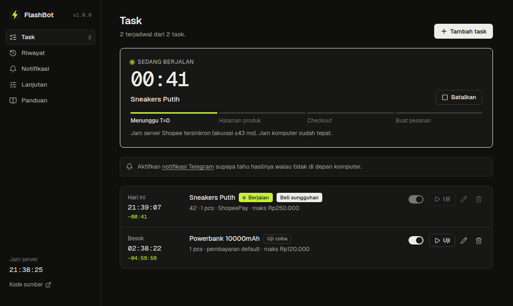
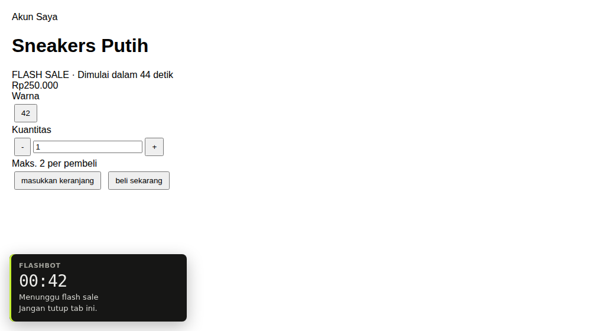
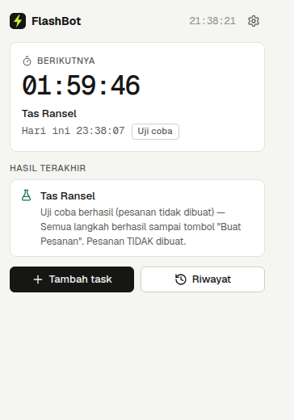

<div align="center">
  

# FlashBot Checkout

Chrome extension open source untuk checkout otomatis flash sale Shopee Indonesia tepat waktu,
langsung dari browser dan akun Shopee kamu sendiri.

[Unduh versi terbaru](../../releases/latest) · [Laporkan masalah](../../issues/new?template=bug_report.yml) · [Berkontribusi](CONTRIBUTING.md)

</div>

<p align="center">
  
</p>

## Apa yang dilakukan

Kamu mengisi link produk dan jam flash sale. Menjelang waktunya, FlashBot membuka halaman produk, lalu tepat saat flash sale dimulai memuat ulang halaman dan mengklik tombol yang sama seperti yang akan kamu klik:
pilih varian, atur jumlah, **Beli Sekarang**, **Checkout**, pilih pembayaran, lalu **Buat Pesanan**.

- **Waktu mengikuti jam server Shopee**, bukan jam komputer. Selisihnya dihitung otomatis.
- **Mode uji coba dan tombol Uji** menjalankan semua langkah tapi berhenti sebelum Buat Pesanan.
- **Pengaman:**
  - batal kalau total melebihi harga maksimal
  - tidak membeli kalau flash sale ternyata belum mulai
  - Buat Pesanan tidak pernah diklik dua kali
- **Beberapa task** bisa berjalan bersamaan di tab terpisah.
- **Notifikasi Telegram** saat bot siap, berhasil, atau gagal.
- **Riwayat** mencatat setiap langkah sampai milidetik dan bisa disalin sebagai laporan.
- **Teks tombol bisa diubah** dari pengaturan kalau tampilan Shopee berubah, tanpa menunggu update.

FlashBot tidak meminta password dan tidak menyalin cookie. Semua data tersimpan di browser kamu ([detail](SECURITY.md)).

## Pasang

1. Unduh `flashbot-checkout-v*.zip` dari [Releases](../../releases/latest), lalu ekstrak ke folder yang tidak akan dihapus.
2. Buka `chrome://extensions`, aktifkan **Developer mode** (kanan atas).
3. Klik **Load unpacked**, pilih folder hasil ekstrak.

Untuk update: ekstrak versi baru ke folder yang sama, lalu klik ikon muat ulang di kartu FlashBot pada `chrome://extensions`. Task dan pengaturan tetap tersimpan.

## Pakai

1. Login Shopee di Chrome yang sama dan pastikan alamat utama benar.
2. Buka FlashBot → **Tambah task**. Isi link produk, jam flash sale, dan sebaiknya **harga maksimal**. Varian, jumlah, dan metode pembayaran opsional.
3. Klik **Uji** pada task. Cek hasilnya di **Riwayat**.
4. Kalau uji berhasil, edit task dan pilih mode **Beli sungguhan**.
5. Biarkan komputer menyala dan Chrome terbuka sampai flash sale selesai.

Metode pembayaran bertingkat ditulis dengan `>`, misalnya `Transfer Bank > Bank BCA`. Kosongkan item lain yang tercentang di keranjang supaya hanya produk target yang ikut checkout.

**Notifikasi Telegram:** buat bot lewat @BotFather, tempel tokennya di tab **Notifikasi**, kirim `/start` ke bot itu, lalu klik **Deteksi otomatis**.

## Tampilan

| Daftar task | Tambah task |
|---|---|
|  |  |
| **Riwayat** | **Mode gelap** |
|  |  |
| **Di halaman Shopee** | **Popup** |
|  |  |

## Kalau gagal

| Pesan | Yang perlu dilakukan |
|---|---|
| Varian "…" tidak ditemukan | Samakan dengan tulisan tombol varian. Pesan error menampilkan pilihan yang terlihat. |
| Tombol "…" tidak ditemukan | Tulisan tombol Shopee berubah. Perbarui di **Lanjutan › Teks tombol**. |
| Shopee meminta login / verifikasi | Selesaikan manual. FlashBot tidak melewati captcha. |
| Flash sale belum dimulai | Periksa jam di task. |

Masih gagal? Klik **Salin laporan** di Riwayat lalu [buat issue](../../issues/new?template=bug_report.yml).

## Batasan

- Komputer harus menyala dan Chrome terbuka saat flash sale. Jadwal yang terlewat dilaporkan.
- Stok flash sale sangat terbatas, jadi keberhasilan tidak dijamin.
- FlashBot tidak membongkar proteksi Shopee, tidak melewati captcha, dan tidak menyembunyikan diri dari deteksi.
- FlashBot tidak berafiliasi dengan Shopee. Alat otomatis dapat bertentangan dengan Syarat & Ketentuan Shopee dan berisiko pada akun. Gunakan dengan tanggung jawab sendiri.

## Pengembangan

```bash
npm install
npm run lint && npm test && npm run test:e2e
npm run pack
```

Test end-to-end menjalankan extension asli di Chromium melawan Shopee tiruan (server HTTPS lokal). Lihat [CONTRIBUTING.md](CONTRIBUTING.md) untuk struktur kode dan cara merilis.

## Lisensi

[MIT](LICENSE)
